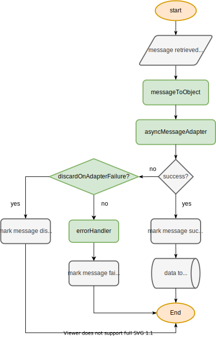

#  Queue Consumer

[](https://circleci.com/gh/b2wads/b2wads-auto-manager)
[](https://codecov.io/gh/b2wads/queue-consumer)

Minimalist Node.js framework for creating consumers for work queues.

For detailed usage information, check the [API Reference](docs/api-reference.md).

#### Table of Contents
- [Usage Overview](#usage-overview)
- [Components](#components)
  - [Consumer](#consumer)
    - [Preparation](#preparation)
    - [Output](#output)
  - [Driver](#driver)

## Usage Overview

```JavaScript
const { Consumer, RabbitDriver } = require('@b2wads/queue-consumer')

const prepareData = async data => ({ prepared: data.raw })
const outputData = async dataArray => console.log(dataArray)

const driver = new RabbitDriver({
  uri: 'amqp://localhost',
  queue: 'example',
  batchSize: 15
})

const consumer = new Consumer({
  driver,
  asyncMessageAdapter: prepareData,
  asyncBatchOutput: outputData,
  batchSize: 15
})

consumer.start()
```

## Components

### Consumer

The Consumer processes messages retrieved by a [driver](#driver) and reports the processing status of each message back to it. Messages are processed in batches of fixed size. If there are not enough messages to complete a batch, a smaller batch is processed after a fixed delay.

The processing of messages is divided into two stages: [preparation](#preparation) and [output](#output).

#### Preparation

In this stage, all messages are validated and the data to be sent forward (if any) is created. The following flowchart demonstrates how data is handled in this stage:



The steps highlighted in green can be defined by the developer in the Consumer's constructor. Check the [API Reference](docs/api-reference.md) for details.

#### Output

In this stage, all data created in the preparation step is sent forward. The process is extremely simple: all the data created in the [preparation stage](#preparation) is sent to a user-defined function which handles the data output.

The user-defined function should be atomic - a single failure in this step will result in all messages failing. If the data cannot be output atomically, the user can either output the data during the [preparation stage](#preparation) or manually handle exceptions in the output stage.

### Driver

The driver is responsible for retrieving messages from the queue system and handling all failures and successes after messages are processed.

The framework was created with RabbitMQ in mind and a driver for it is supplied in the package. For details on how to use it, check the [API Reference](docs/api-reference.md)

